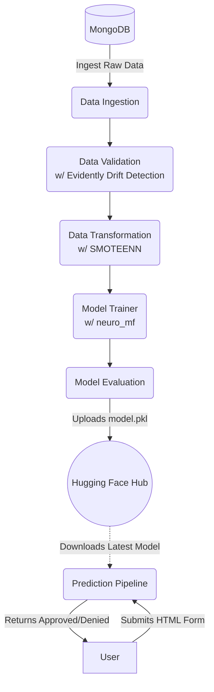
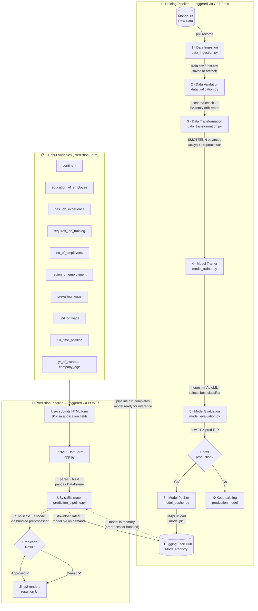

# 🛂 US Visa Approval Prediction System


---

## 📖 Problem Statement

The **US Visa Approval Prediction System** is a production-grade MLOps project designed to predict the likelihood of US visa application approvals. By analyzing historical application data, demographic details, and professional backgrounds, this system provides applicants and employers with an early indicator of their visa status, streamlining immigration workflows and reducing uncertainty.

---

## 🏗️ Architecture Diagram



---

## 🔄 Complete System Workflow

This section describes the end-to-end flow of the system — from user input through training and inference — including every component, data artifact, and decision point.



### Training Pipeline — Step by Step

| Step | Component               | Input                           | Output                                            |
| :--- | :---------------------- | :------------------------------ | :------------------------------------------------ |
| 1    | **Data Ingestion**      | MongoDB collection              | `train.csv`, `test.csv` in `artifact/`            |
| 2    | **Data Validation**     | `train.csv` / `test.csv`        | Schema report + `drift_report.yaml`               |
| 3    | **Data Transformation** | Validated CSVs                  | Balanced NumPy arrays + fitted `preprocessor.pkl` |
| 4    | **Model Trainer**       | Transformed arrays              | Best classifier wrapped as `USvisaModel`          |
| 5    | **Model Evaluation**    | New model + HF production model | F1 comparison result                              |
| 6    | **Model Pusher**        | Validated `model.pkl`           | Uploaded artifact on Hugging Face Hub             |

### Prediction Pipeline — Step by Step

| Step | Component              | What Happens                                                                 |
| :--- | :--------------------- | :--------------------------------------------------------------------------- |
| 1    | HTML Form (`/`)        | User fills in 10 visa application fields and submits                         |
| 2    | `DataForm` in `app.py` | FastAPI parses the POST body and converts it to a pandas DataFrame           |
| 3    | `USvisaEstimator`      | Downloads the latest `model.pkl` from Hugging Face Hub into memory           |
| 4    | Bundled Preprocessor   | `PowerTransformer` + `StandardScaler` auto-applied — no separate step needed |
| 5    | Classifier inference   | Model returns `Approved` or `Denied`                                         |
| 6    | Jinja2 template        | Result rendered dynamically back onto the web UI                             |

### Input Variables Reference

| Field                   | Type        | Description                                                    |
| :---------------------- | :---------- | :------------------------------------------------------------- |
| `continent`             | Categorical | Continent of the applicant's origin                            |
| `education_of_employee` | Categorical | Highest education level attained                               |
| `has_job_experience`    | Binary      | Whether the applicant has prior job experience                 |
| `requires_job_training` | Binary      | Whether the role requires job training                         |
| `no_of_employees`       | Numeric     | Number of employees in the sponsoring company                  |
| `region_of_employment`  | Categorical | US region where the job is located                             |
| `prevailing_wage`       | Numeric     | Prevailing wage for the position                               |
| `unit_of_wage`          | Categorical | Wage unit — hourly, weekly, monthly, or yearly                 |
| `full_time_position`    | Binary      | Whether the position is full-time                              |
| `yr_of_estab`           | Numeric     | Year the company was established → engineered to `company_age` |

---

## 💻 Tech Stack

| Component                    | Technology         |
| :--------------------------- | :----------------- |
| **Web Framework**            | FastAPI (`app.py`) |
| **Database**                 | MongoDB            |
| **Model Registry & Serving** | Hugging Face Hub   |
| **Deployment**               | Render             |
| **Language**                 | Python             |

---

## 📁 Project Structure

```text
us_visa/
├── artifact/            # Generated outputs (train.csv, model.pkl, drift reports)
├── config/              # Configuration files (YAML schemas, model configs)
├── logs/                # Application runtime logs
├── notebook/            # Jupyter notebooks for EDA and experimentation
├── templates/           # Jinja2 HTML templates for the FastAPI UI
├── components/          # Core pipeline execution stages
│   ├── __init__.py
│   ├── data_ingestion.py      # Pulls raw data from MongoDB
│   ├── data_validation.py     # Schema validation and Data Drift detection
│   ├── data_transformation.py # Feature engineering, SMOTEENN imbalance handling
│   ├── model_evaluation.py    # Compares new models against HF production models
│   ├── model_pusher.py        # Uploads validated models to Hugging Face
│   └── model_trainer.py       # AutoML model selection using neuro_mf
├── configuration/       # Global configuration and environment setup
├── constants/           # Project-wide constant variables (ports, strings)
├── data_access/         # Database connection handlers for MongoDB
├── entity/              # Data classes for configs, artifacts, and estimators
├── exception/           # Custom exception handling mechanism
├── logger/              # Custom logging module setup
├── pipeline/            # End-to-end flow orchestration
│   ├── __init__.py
│   ├── prediction_pipeline.py # Handles incoming inference requests
│   └── training_pipeline.py   # Orchestrates model training stages sequentially
├── utils/               # Reusable modular utility functions (YAML IO, array saving)
├── .env                 # Environment variables (DB URI, HF Token)
├── app.py               # FastAPI application entry point
├── demo.py              # Script to run the pipeline manually
├── Dockerfile           # Instructions for containerizing the application
├── requirements.txt     # Python package dependencies
├── runtime.txt          # Python runtime version identifier
├── setup.py             # Python packaging setup script
└── template.py          # Script for generating boilerplate project structure
```

---

## ⚙️ Setup & Installation

1. **Clone the repository:**

   ```bash
   git clone <your-repo-url>
   cd US-visa
   ```

2. **Create a `.env` file:**
   Create a `.env` file in the root directory containing your secure credentials:

   ```env
   MONGODB_URI="your_mongodb_connection_string"
   HUGGINGFACE_TOKEN="your_huggingface_access_token"
   ```

3. **Install dependencies:**

   ```bash
   pip install -r requirements.txt
   ```

4. **Install the package locally:**

   ```bash
   python setup.py install
   ```

---

## 🚀 Running the App

**Local Execution:**

```bash
python app.py
```

---

## 🌐 API Endpoints

| Route    | Method   | Description                                         |
| :------- | :------- | :-------------------------------------------------- |
| `/`      | GET/POST | Home page with prediction form and inference output |
| `/train` | GET      | Triggers full, sequential training pipeline         |

---

## 🌟 MLOps Highlights

- **Unified Artifact Serving on Hugging Face:** Escapes heavy reliance on AWS S3/MLflow by using Hugging Face as a nimble, remote model registry and versioning system.
- **Automated Data Drift Detection:** Ensures model reliability by actively checking reference vs. current data distributions using the `evidently` metrics framework.
- **Advanced Imbalance Management:** Employs `SMOTEENN` (Synthetic Minority Over-sampling Technique + Edited Nearest Neighbors) to ensure fairness in heavily skewed immigration datasets.
- **Smart Pipeline Orchestration:** Clean Object-Oriented design that inherently restricts data leaks by creating modular `Artifact` classes passed dynamically between components.

---

## 🔐 Environment Variables

| Variable            | Description                                                                 |
| :------------------ | :-------------------------------------------------------------------------- |
| `MONGODB_URI`       | Secure connection string URI for your MongoDB cluster                       |
| `HUGGINGFACE_TOKEN` | Read/Write access token for interacting with your Hugging Face Hub registry |

---

## 🤝 Contributing

Contributions are always welcome. Please feel free to fork this repository, create feature branches, and submit Pull Requests.

---

## Contact

**Developer:** Parth Ahuja  
**GitHub:** [@ParthAhuja4](https://github.com/ParthAhuja4)  
**Email:** [parthahuja006@gmail.com](mailto:parthahuja006@gmail.com)
**Linked In:** [Parth Ahuja](https://www.linkedin.com/in/parthahuja4)
